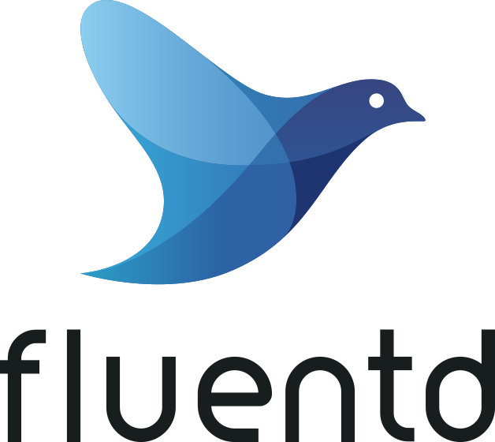

# Fluentd: de universele logger



*[Lynn Mombarg, oktober 2024.](https://github.com/hanaim-devops/LynnMombarg)*
<hr/>
In deze blogpost onderzoek ik hoe Fluentd kan worden toegepast in een applicatie dat draait in Kubernetes. Deze technologie ga ik namelijk toepassen in het beroepsproduct waarmee we de coursefase aflsuiten. De applicatie ontwikkelen we volgens de DevOps ideologie. Ik kijk daarom ook naar het verband tussen DevOps en Fluentd.

De eigen website (Fluentd, z.d.) legt uit dat Fluentd een open-source data verzamelaar is die de data samenvoegt tot een geheel zodat dit beter te begrijpen is. Fluentd doet dit door alle verzamelde data in een JSON format te zetten. Deze data kan bijvoorbeeld gaan over buffering, outputting of filtering en kan worden verzameld uit meerdere bronnen. De universele data kan daarna naar een output source gestuurd worden zoals bijvoorbeeld Elasticsearch of Grafana. Die tonen de data visueel aan de gebruiker. Fluentd is handig om grip op- en kennis over je systeem te krijgen.
<!-- TOC -->

- [Fluentd: de universele logger](#fluentd-de-universele-logger)
    - [Kubernetes](#kubernetes)
    - [Logger vs. Monitor](#logger-vs-monitor)
    - [DevOps principes](#devops-principes)
        - [Automatisering](#automatisering)
        - [Monitoring en Observability](#monitoring-en-observability)
        - [Integratie met CI/CD](#integratie-met-cicd)
    - [Alternatieve tools Competitive analasys, tabel maken](#alternatieve-tools-competitive-analasys-tabel-maken)
        - [Logstash](#logstash)
        - [Vector](#vector)
    - [Voor- en nadelen van Fluentd](#voor--en-nadelen-van-fluentd)
    - [Fluentd gebruiken Proof of concept](#fluentd-gebruiken-proof-of-concept)
        - [Fluentd met Grafana](#fluentd-met-grafana)
        - [Installatie met Helm](#installatie-met-helm)
    - [Pitstop applicatie](#pitstop-applicatie)
    - [Conclusie](#conclusie)
    - [Bronvermelding](#bronvermelding)

<!-- /TOC -->
<!-- /TOC -->

## Kubernetes

De blogpost van Goltsman (2021) beschrijft dat Docker containers in Kubernetes standaard outputs en standaard errors loggen. Docker redirect deze loggings naar een Kubernetes driver. Via Kubectl logs kunnen gebruikers deze logs inzien. Het probleem is echter dat als je een pod verwijdert, alle containers en hun loggings ook verwijderd worden. Dit probleem los je op door een onafhankelijke logger in te bouwen.

De Kubernetes architectuur faciliteert een aantal opties om logs te beheren. Een paar daarvan zijn:

- gebruik van sidecar container die in een app's pod draait.
- gebruik van een node-niveau logging agent die op elke node draait.
- logs direct naar een backend pushen.

In deze blogpost kijk ik dus expliciet naar het gebruik van de Fluentd logging agent die op elke node draait. In Kubernetes heb je type DaemonSet voor een Deployment. Hiermee geef je aan dat op elke node een copy van de logging agent wilt. Een node logging agent is wel gelimiteerd tot de standaard output en -streams van de applicatie.

<p align="center">
  <br>
  (Goltsman, 2021)
</p>

Bovenstaande figuur geeft een node weer die twee pods bevat. Deze pods sturen hun logs naar de Fluentd container. Afhankelijk van de configuratie stuurt de logging agent de logs bijvoorbeeld door naar Elasticsearch, zoals in het plaatje staat. Dit kan ook een andere plugin zijn.

## Logger vs. Monitor

In het landschap van CNCF staat Fluentd onder de categorie Observability. 

<p align="center">
  <br>
  (CNCF Landscape, z.d.)
</p>

"*Observability is the practice and ability of a system to be understood from its external outputs*" (CNCF Landscape, z.d.-b). 

Binnen observability vallen verschillende tools. Monitoring, logging etc. Tools ter monitoring zijn vaak visueel zodat je binnenkomende data makkelijk kunt begrijpen. Loggers worden in het systeem gebouwd om informatie te verkijgen over bijvoorbeeld foutmeldingen of events. Maar waar valt Fluentd dan precies onder? Fluentd zit er eigenlijk tussenin. Het verzamelt de logs en stuurt het door naar een monitoring tool. Je noemt zoiets ook wel een log aggregator. In Datadog (2021) staat dat Log aggregation het proces is van data verzamelen, standaardiseren en samenvoegen om een gestroomlijnde log analyze aan te bieden. Zonder log aggregators moeten developers alle data zelf organiseren, voorbereiden en extraheren.

## DevOps principes

Fluentd valt op allerlei manieren samen met principes van DevOps. Een prompt naar OpenAI (2024) genereert een aantal principes die samengaan met de log aggregator.

### Automatisering

Fluentd automatiseert het proces van logverzameling en -verwerking. Dit vermindert handmatige inspanning en minimaliseert fouten.

### Monitoring en Observability

Een van de kernprincipes van DevOps is het waarborgen van zichtbaarheid in de applicatie en infrastructuur. Fluentd verzamelt logs uit verschillende bronnen (zoals applicaties, servers en cloud-omgevingen) en maakt deze toegankelijk voor monitoringtools. Dit helpt teams bij het snel identificeren van problemen en het verbeteren van de prestaties.

### Integratie met CI/CD

Fluentd kan worden geïntegreerd met Continuous Integration/Continuous Deployment (CI/CD) pipelines om real-time logs en metrics te verzamelen. Dit stelt teams in staat om de prestaties van hun applicaties tijdens de implementatiefase te volgen en eventuele problemen onmiddellijk aan te pakken.

## Alternatieve tools (Competitive analasys, tabel maken)

Er bestaan redelijk wat tools die ongeveer hetzelfde doen als Fluentd. Fluentd is echter wel de grootste die ook door grote bedrijven wordt gebruikt. Denk aan Amazon Web Services en Change.org. 

Onderstaande alternatieven zijn te vinden op de website van CNCF Landscape (z.d.-b).

### Logstash


"*Logstash is a free and open server-side data processing pipeline that ingests data from a multitude of sources, transforms it, and then sends it to your favorite stash*" (LogStash: Collect, Parse, Transform Logs | Elastic, z.d.). 

### Vector


"*Vector is a robust open-source log aggregator developed by Datadog. It empowers you to build observability pipelines by seamlessly fetching logs from many sources, transforming the data as needed, and routing it to your preferred destination* (Better Stack Community, 2024)"

## Voor- en nadelen van Fluentd

**Voordelen**

- Lightweight en resource-efficient.
- Plugin ecosysteem om functionaliteit toe te voegen.
- Zowel gestructureerde als ongestructureerde data parsen.
- Data exporteren naar veel verschillende bestemmingen.

**Nadelen**

- Handmatige configuratie kan lastig zijn.
- Minder grote selectie van plugins dan alternatief Logstash.

## Fluentd gebruiken (Proof of concept)

In dit onderzoek kijk ik naar twee methoden om Fluentd te installeren in een Kubernetes cluster.

### Fluentd met Grafana

Voor een eerste opzetje van Fluentd maak ik gebruik van een Github repository die een Python applicatie bevat die gaat over planten. Daarbij zet ik de loki plugin op Fluentd zodat ik voor mijn monitoring gebruik kan maken van Grafana. Dit doe ik met het oog op het beroepsproduct. Daar maken we namelijk gebruik van Grafana.

De eerste stap is om de Github repo te clonen.

```bash
git clone -b microservice-fluentd https://github.com/grafana/loki-fundamentals.git
```

De code bevat een fluentd.config. Zet de volgende code in het bestand.

```
<source>
  @type forward
  port 24224
  bind 0.0.0.0
</source>

<match>
  @type loki
  url "http://loki:3100"
  extra_labels {"agent": "fluentd"}
  <label>
    service_name $.service
    instance_id $.instance_id
  </label>
  <buffer>
    flush_internal 10s
    flush_at_shutdown true
    chunk_limit_size 1m
  </buffer>
</match>
```

(Uitleg over config)

De code bevat nu alleen nog docker-compose bestanden. Run eerst de docker-compose die Fluentd en Grafana opzet. Daarna de docker-compose-micro die de app zelf runt.

```bash
docker compose up
docker compose -f .\greenhouse\docker-compose-micro.yml up -d --build
```

Via http://localhost:5005 kun je de plantenapp bereiken. Doe hier bijvoorbeeld een login.

Ga daarna naar http://localhost:3000. Onder Explore vind je Logs. Je ziet nu verschillende services en de logs die ze hebben binnengekregen. Een voorbeeld van de logs die de main_app heeft binnengekregen zie je hieronder. De bovenstaande (laatste) request die je ziet, is een POST request vanaf mijn laptop (ip-adres 127.20.0.1) om in te loggen.


### Installatie met Helm

Een snelle manier om Fluentd in je Kubernetes cluster te installeren is om Helm te gebruiken. Helm is een package manager voor Kuberenetes. Op deze manier heb je binnen een paar minuten Fluentd pods runnen in je cluster. Vereiste is dat je Helm hebt geinstalleerd op je machine.

Voeg een Helm repo toe waar Fluentd charts gehost worden.

```bash
helm repo add bitnami https://charts.bitnami.com/bitnami
helm repo update
```

Optioneel kun je een andere namespace gebruiken voor je pods.

```bash
kubectl create namespace logging
```

Installeer Fluentd met Helm chart.

```bash
helm install fluentd bitnami/fluentd --namespace logging
```

Verifieer de pods.

```bash
kubectl get pods -n logging
```

Je zou dan dit resultaat zien in je terminal:<br>


Fluentd geeft vervolgens logs van de applicatie. Onderstaande log gaat over de leaderelection in mijn cluster.

```
2024-10-08 15:24:03 2024-10-08 13:16:31.898678959 +0000 kubernetes.var.log.containers.kube-scheduler-docker-desktop_kube-system_kube-scheduler-f8638c76e167b67996d28f3daf166d369b5685306ee6e1335dee20e1b5c68dd5.log: {"log":"I1008 13:16:31.898334       1 leaderelection.go:250] attempting to acquire leader lease kube-system/kube-scheduler...\n","stream":"stderr","docker":{"container_id":"f8638c76e167b67996d28f3daf166d369b5685306ee6e1335dee20e1b5c68dd5"},"kubernetes":{"container_name":"kube-scheduler","namespace_name":"kube-system","pod_name":"kube-scheduler-docker-desktop","container_image":"registry.k8s.io/kube-scheduler:v1.30.2","container_image_id":"docker://sha256:7820c83aa139453522e9028341d0d4f23ca2721ec80c7a47425446d11157b940","pod_id":"f710756d-0161-4506-a49f-b71285dca0a6","pod_ip":"192.168.65.3","host":"docker-desktop","labels":{"component":"kube-scheduler","tier":"control-plane"},"master_url":"https://10.96.0.1:443/api","namespace_id":"af41635f-986c-43ce-80a0-168ba2c0ff8c","namespace_labels":{"kubernetes.io/metadata.name":"kube-system"}}}
```

## Pitstop applicatie

## Conclusie

## Bronvermelding

- CNCF Landscape. (z.d.). Geraadpleegd op 8 okt 2024, van <https://landscape.cncf.io/>
- CNCF Landscape. (z.d.-b). Geraadpleegd op 8 okt 2024, van <https://landscape.cncf.io/guide#observability-and-analysis--observability>
- Datadog. (2021, 3 augustus). Log Aggregation: What it is & How it works | DataDog. Datadog. Geraadpleegd op 8 okt 2024, van <https://www.datadoghq.com/knowledge-center/log-aggregation/>
- Fluentd. (z.d.). What is Fluentd? | Fluentd. Geraadpleegd op 7 okt 2024, van <https://www.fluentd.org/architecture>
- Goltsman, K. (2021, 7 december). Cluster-level Logging in Kubernetes with Fluentd - Supergiant.io - Medium. Medium. Geraadpleegd op 8 okt 2024, van <https://medium.com/kubernetes-tutorials/cluster-level-logging-in-kubernetes-with-fluentd-e59aa2b6093a>
- How to Collect, Process, and Ship Log Data with Vector | Better Stack Community. (2024, 9 januari). Geraadpleegd op 8 okt 2024, van <https://betterstack.com/community/guides/logging/vector-explained/>
- LogStash: Collect, Parse, Transform Logs | Elastic. (z.d.). Elastic. Geraadpleegd op 8 okt 2024, van <https://www.elastic.co/logstash>
- OpenAI. (2024). ChatGPT (8 okt. versie) [Large language model]. Geraadpleegd op 8 okt 2024, van <https://chatgpt.com/c/670501ea-a374-8013-9b92-001743c0c48c>
